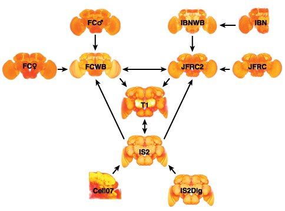

Introduction
============
The fly brain is a highly stereotyped 3D structure.  A number of groups have now published 3D confocal image datasets where all images have been registered to a specific template brain. In order to co-visualise image data from different studies, data registered against different template brains must be brought into the same 3D coordinate space. This can be achieved by applying a "bridging registration" which maps one template brain onto another.

Details
=======
Each bridging registration in this repository maps one common template brain onto another. The naming convention is `TARGET_SOURCE.list` where TARGET is a short name for the final template brain and SOURCE is a short name for the template that defines the starting space. Thus to map image data in the IS2 space (Cachero, Ostrovsky et al 2010) to the JFRC2 template space (see [virtual fly brain](http://www.virtualflybrain.org) for details) one would want `JFRC2_IS2.list`. 

Software
========
All bridging registrations were constructed with the aid of the open source Computational Morphometry Toolkit ([CMTK](http://www.nitrc.org/projects/cmtk/)) . In each cases the final output contains a non-rigid (warping) intensity-based registration between two template brains (CMTK command `warp`). In certain cases the initial affine that was used as a starting step was computed using a surface or landmarks-based registration rather than CMTK's intensity based registration (`registration`).  You will need to install a recent (>=2.2) version of CMTK to use these registrations.

Usage
=====

First download (or git clone) this repository

We recommend that you convert all images to the [NRRD format](http://teem.sourceforge.net/nrrd/). [Fiji/ImageJ](http://fiji.sc) can read and write this format.

Image data
----------

    reformatx --floating sample_image.nrrd template_brain.nrrd target_source.list

Note that reformatx uses the `template_brain.nrrd` to determine the size and spatial location of the block of image data to produce. If you do not have the template brain, you can still produce output by manually defining the region that you want using reformatx's `--target-grid` option. 

    --target-grid <string>
              Define target grid for reformating as Nx,Ny,Nz:dX,dY,dZ[:Ox,Oy,Oz] (dims:pixel:offset)

For details

    reformatx --help

3D coordinates
--------------

White space separated 3d coordinates can be converted (in either direction) using 

    streamxform -- --inverse target_source.list < source_coords.txt > target_coords.txt
    streamxform target_source.list < target_coords.txt > sample_coords.txt

Note the use of the `--inverse` switch when mapping coordinates from source space to target space. This may be the opposite of what you expect but originates from the fact that in order to map a block of image data from source space to target space, the transformation that must actually be defined is the one that maps a regular grid of points in the target space back to sample locations in the source space. Note also the use of an extra `--` to separate the positional arguments from the other options when using `--inverse` to specify that a given registration should be inverted.

For details

    streamxform --help

Example
-------
Map the (fly's) left tip of the protocerebral bridge from JFRC2 to IS2 space.

    cd /path/to/BridgingRegistrations
    echo 365 113 112 | streamxform -- JFRC2_IS2.list
    # 196.857602 135.684389 153.386743 
    # which is close to the manually defined position 198 134 150

Now map the location in JFRC2 space back to IS2:

    echo 196.857602 135.684389 153.386743 | streamxform -- --inverse JFRC2_IS2.list
    # 365 113 112

i.e. the round trip JFRC2->IS2->JFRC2 gives back the original coordinates. Note that the `JFRC2_IS2.list` registration can map images in IS2 space to JFRC2 but must be inverted to do the same for points. 

Limitations
===========
These bridging registrations are rarely as accurate registrations for data acquired in the same lab on the same microscope. Nevertheless we find them to be very useful for comparative work across coordinate spaces.
